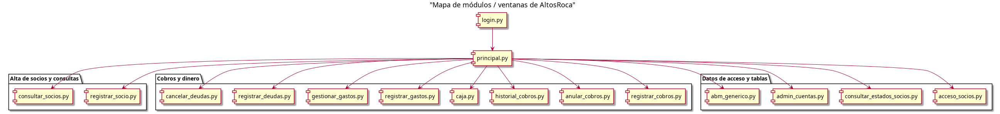
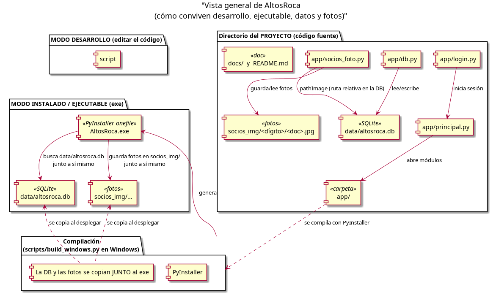
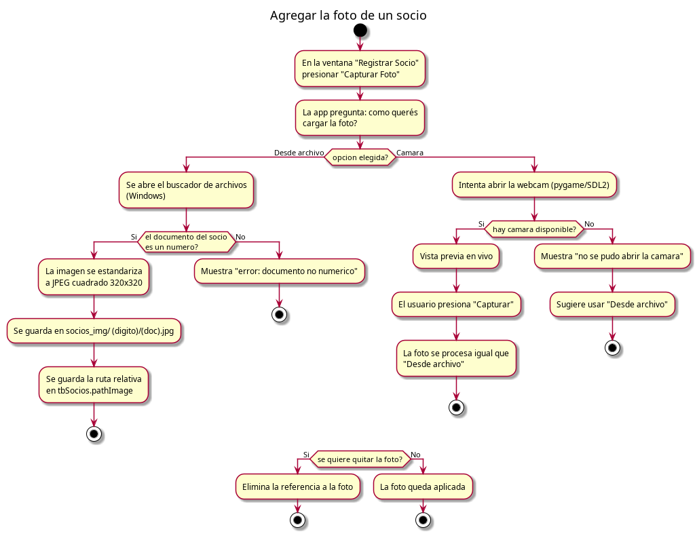
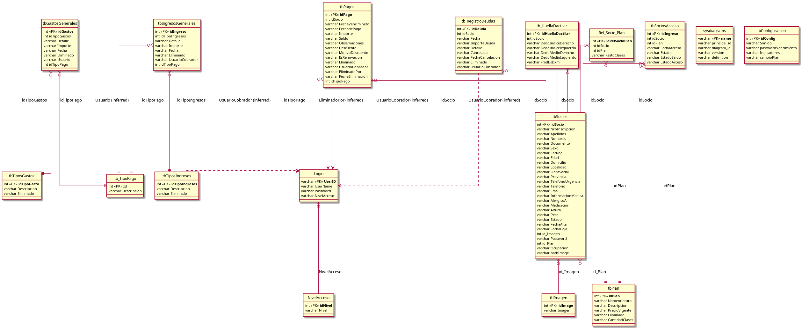

# AltosRoca · Sistema de Gestión de Gimnasio

Aplicación de escritorio para **Windows** hecha en **Python + Tkinter** que
administra socios, cobros de cuotas, deudas, gastos, ingresos y accesos de un
gimnasio. Es un programa de ventanas (como una planilla de cálculo o un
programa contable), **no** una página web.

Este documento está pensado para todos los niveles: desde alguien que solo
quiere **usar** el programa, hasta quien quiere **editar el código** sin haber
programado nunca en Python.

---

## 1. ¿Qué hace el sistema? (para quien no lo conoce)



- **Login / Acceso**: usa un usuario y contraseña guardados en la base.
- **Socios**: alta, edición, consulta y foto de cada socio.
- **Cobros**: registrar cobros de cuotas y anularlos si hace falta.
- **Deudas**: registrar y cancelar deudas de socios.
- **Gastos e ingresos**: registrar gastos e ingresos, y ver la caja.
- **Accesos**: registrar el ingreso de cada socio al gimnasio y ver su estado.
- **ABM**: alta / modificación / borrado de tablas de control (planes, formas
  de pago, tipos de gasto/ingreso).

Para empezar a probarlo, hay que **instalar un entorno de desarrollo** (sección
2) o tener el **ejecutable compilado** (sección 4). Después se abre y se inicia
sesión con un usuario de prueba, p. ej. `Admin` / `Lola88mora`.

---

## 2. Recrear el entorno de desarrollo (editar el código)

> Objetivo: tener el código fuente en tu PC y poder **ver, modificar y ejecutar**
> cualquier parte del programa. No hace falta saber programar para seguir estos
> pasos; alcanza con poder copiar y pegar comandos.

### 2.1 Instalar Python 3

El programa está escrito en Python. Se necesita Python versión **3.12** (también
3.8–3.13 funcionan; 3.8 se usa solo para el exe compatible con Windows 7).

1. Bajar el instalador oficial: <https://www.python.org/downloads/>
   (elegir la versión estable, por ejemplo **3.12.x** para Windows).
2. Ejecutar el instalador.
   - **IMPORTANTE**: marcar la casilla **"Add python.exe to PATH"**.
   - Hacer clic en **Install Now**.
3. Verificar que quedó bien instalado abriendo una terminal (PowerShell) y
   escribiendo:
   ```powershell
   py --version
   ```
   Debe responder algo como `Python 3.12.x`.

> Alternativa moderna: `winget install --id Python.Python.3.12 -e`

> Tkinter (las ventanas) y SQLite (la base) **ya vienen incluidos** en Python;
> no hay que instalarlos aparte.

### 2.2 Obtener el código del proyecto

El proyecto vive en una carpeta (p. ej. `altosrocapy`). Si tenés la carpeta
descargada, pasá a la sección 2.3. Si querés clonarlo desde el control de
versiones:

```powershell
git clone <url-del-repositorio>
cd altosrocapy
```

### 2.3 Instalar las librerías que usa el programa

El programa usa algunas librerías extra. Se instalan con un solo comando en la
terminal, **dentro de la carpeta del proyecto**:

```powershell
py -m pip install --upgrade pip
py -m pip install -r requirements.txt
```

Si no hay archivo `requirements.txt` en el proyecto, instalar las que se usan
(según lo que diga el código al importar):

```powershell
py -m pip install pillow tkcalendar fpdf2 openpyxl pygame
```

> **pillow** = fotos · **tkcalendar** = calendarios para elegir fechas ·
> **fpdf2** y **openpyxl** = exportar reportes PDF/Excel · **pygame** = abrir la
> cámara de la webcam.

### 2.4 Ejecutar el programa (modo desarrollo)

Con las librerías instaladas y la base de datos en su lugar, se ejecuta desde la
terminal con:

```powershell
py app\login.py
```

Debería abrirse la ventana de **login**. Iniciá sesión con un usuario de prueba
(ver tabla `Login`, p. ej. `Admin` / `Lola88mora`).

Cómo se ve esto en un diagrama:



---

## 3. Cómo está organizado el código (para editarlo)

La estructura canónica es esta:

```
altosrocapy/
├── app/                    # ← TODO el código fuente (ventanas)
│   ├── login.py            # ventana de login (entrada del programa)
│   ├── principal.py        # menú principal / panel
│   ├── registrar_socio.py  # alta y edición de socios (+ foto)
│   ├── consultar_socios.py # consulta de socios y sus datos
│   ├── registrar_cobros.py # registrar cobros de cuotas
│   ├── anular_cobros.py    # anular cobros
│   ├── historial_cobros.py # historial de cobros
│   ├── caja.py             # caja (ingresos y gastos)
│   ├── registrar_gastos.py # registrar gastos
│   ├── gestionar_gastos.py # gestionar/editar gastos
│   ├── registrar_deudas.py # registrar deudas
│   ├── cancelar_deudas.py  # cancelar deudas
│   ├── acceso_socios.py    # registrar accesos de socios
│   ├── consultar_estados_socios.py  # estados y vencimientos
│   ├── admin_cuentas.py    # administrar usuarios/login
│   ├── abm_generico.py     # ABM genérico de tablas de control
│   ├── db.py               # conexión a la base (SQLite)
│   ├── socios_foto.py      # cómo se guardan/leen las fotos
│   ├── resources.py        # logo e iconos
│   └── simclock.py         # reloj simulado (para pruebas)
├── data/
│   └── altosroca.db        # base de datos SQLite (NO se sube al repositorio)
├── socios_img/             # fotos de socios (se crea sola, NO versionada)
├── scripts/
│   ├── build_windows.py    # compila el .exe (Windows)
│   └── import_tsv_to_sqlite.py
├── docs/                   # esta documentación + diagramas
│   └── diagramas/
│       ├── arquitectura.png
│       ├── flujo-login.png
│       ├── flujo-foto.png
│       ├── mapa-modulos.png
│       └── modelo-datos.png
├── dist-windows/           # RESULTADO del build (.exe) — no se edita a mano
├── build/                  # spec y temporales de compilación
└── temps/                  # material temporal / exports (ignorado)
```

Cada `*.py` de `app/` es **una ventana** (o un helper). El diagrama de módulos
(arriba, sección 1) muestra cómo se conectan: `login.py` abre `principal.py`, y
desde ahí se abren el resto de las ventanas.

### 3.1 Reglas básicas al editar

- **`py app\login.py`** ejecuta el programa completo. Para probar una ventana
  aislada conviene usar la documentación de esa ventana (ver `docs/`).
- **No editar** `dist-windows/`, `socios_img/` ni copias de `data/`: se
  regeneran. La base de datos vive **solo** en `data/`.
- Los archivos que empiezan con `db`, `resources`, `socios_foto` son *helpers*:
  manejan la base, el logo y las fotos respectivamente.

---

## 4. Compilar el ejecutable (.exe) para distribuirlo

Paso a paso para generar `AltosRoca.exe` a partir del código:

### Requisitos
- **Python 3.12** instalado (sección 2.1).
- **PyInstaller**:
  ```powershell
  py -m pip install pyinstaller
  ```

### Compilar (método recomendado)
Desde la **raíz del proyecto**, en **PowerShell de Windows** (no hace falta
estar "dentro" de la terminal de WSL):

```powershell
py scripts\build_windows.py --dest "C:\altos roca\dist-windows"
```

El script:
1. Instala las dependencias que falten (solo).
2. Compila el .exe con PyInstaller (siempre limpio: borra el temporario previo).
3. Copia `data\altosroca.db` y deja todo listo en la carpeta destino.

> El exe se compila con el Python que ejecuta el comando: el de **64 bits** por
> defecto. Para máxima compatibilidad (incluso Windows 7 de 32 bits) se usa un
> Python 3.8 de 32 bits y la variante `--win7` del script. Detalles en
> `build/README.md`.

Resultado en el destino:

```
C:\altos roca\dist-windows\
├── AltosRoca.exe       ← doble clic para usar el programa
└── data\
    └── altosroca.db    ← LA base de datos DEBE estar aquí, junto al exe
```

> **IMPORTANTE**: `AltosRoca.exe` **solo** funciona si a su lado hay una carpeta
> `data\` con `altosroca.db`. Es la única base de datos que usarán los datos
> reales. No mover el exe sin su carpeta `data`.

---

## 5. Dónde va cada cosa (datos, fotos, base)

| Qué | Dónde vive | Notas |
|-----|-----------|-------|
| Base de datos (`altosroca.db`) | **Modo desarrollo:** `data\` (raíz del proyecto). **Modo exe:** `data\` **junto a** `AltosRoca.exe`. | El exe busca la DB literalmente al lado de sí mismo (`<carpeta del exe>\data\altosroca.db`). |
| Fotos de socios | Carpeta `socios_img\` (junto al proyecto en desarrollo, o junto al .exe en producción). | Ver sección 6. |
| Logo / icono | `temps\logo.png` | Se empaqueta dentro del exe (no se copia aparte). |
| Reportes exportados | Se eligen al exportar (PDF/Excel) | |

La base de datos y las fotos **no** se versionan en el repositorio (están en
`.gitignore`). Para "llevar el programa a otra PC", se copia la carpeta del exe
con su `data\` y su `socios_img\` completa.

---

## 6. Cómo se guardan y se ven las fotos de socios

Las fotos **no** se guardan dentro de la base de datos (excepto copias legacy
en la tabla `tbImagen`). Se guardan como **archivos .jpg** en una carpeta
`socios_img\`, organizadas por el **último dígito del documento** del socio:

```
socios_img/
├── 0/00000001.jpg
├── 1/12345671.jpg
├── 5/35920785.jpg      ← ejemplo: documento ...85 → carpeta 5
└── ...
```

- Formato: **JPEG cuadrado 320×320**.
- En la tabla `tbSocios` de la base, la columna `pathImage` guarda la **ruta
  relativa** (p. ej. `socios_img/5/35920785.jpg`).
- En **modo desarrollo** la carpeta está en la raíz del proyecto; en **modo
  exe** está **junto al ejecutable** (igual que `data\`), para que las fotos se
  conserven y se puedan ver.



> Si una foto no existe, el programa muestra una silueta (placeholder) en su
> lugar; no da error.

---

## 7. Base de datos (SQLite)

El sistema usa **SQLite**, una base de datos embebida en **un solo archivo**
(`data\altosroca.db`). No hace falta instalar ningún servidor. Cualquier
herramienta de SQLite (o el módulo `sqlite3` de Python) puede abrirla.

Diagrama del modelo de datos (tablas y relaciones principales):



Usuarios de prueba (tabla `Login`): `Admin / Lola88mora`, `MARCO / MKACHA1`,
`JUAN / JUANKA`.

> **Seguridad**: la versión actual guarda las contraseñas **en texto plano**
> en la tabla `Login`. Antes de un despliegue real conviene guardarlas
> con hash (ver `app/db.py`).

---

## 8. Estructura / rutas importantes y diagramas disponibles

Todos los diagramas están renderizados en `docs/diagramas/` (y su código fuente
PlantUML en `docs/diagramas/src/`). Resumen:

| Diagrama | Archivo | Para qué sirve |
|----------|---------|----------------|
| Arquitectura general | `docs/diagramas/arquitectura.png` | Cómo conviven desarrollo y exe. |
| Flujo de login | `docs/diagramas/flujo-login.png` | Qué pasa al iniciar sesión. |
| Flujo de foto | `docs/diagramas/flujo-foto.png` | Cómo se agrega la foto de un socio. |
| Mapa de módulos | `docs/diagramas/mapa-modulos.png` | Ventanas y cómo se conectan. |
| Modelo de datos | `docs/diagramas/modelo-datos.png` | Tablas y relaciones de la base. |

Documentación adicional:
- `build/README.md` — guía detallada de compilación (variantes 32/64 bits,
  Windows 7 x86, CI).
- `docs/estructura-proyecto.md` — reglas de estructura del proyecto.
- `docs/especificaciones/` — especificaciones por ventana (login, principal…).

Si querés **regenerar** los diagramas (por ejemplo, al cambiar el modelo de
datos), en Linux/WSL se usa `plantuml`:

```bash
plantuml -o ../ diagrams/src/*.puml   # desde docs/diagramas/
```

Y el código fuente está en `docs/diagramas/src/` (archivos `.puml`).

---

## 9. Solución de problemas frecuentes

- **"Base de datos no encontrada"**: el exe está sin su carpeta `data\`
  al lado. Copiar `data\altosroca.db` junto a `AltosRoca.exe` (sección 4).
- **"No se pudo abrir la cámara"**: la webcam está en uso por otra app, o no
  hay webcam en esa PC. Usar la opción "Desde archivo" para la foto.
- **La foto no aparece**: revisar que exista el archivo en `socios_img\` y que
  `pathImage` en `tbSocios` tenga la ruta relativa correcta (sección 6).
- **El .exe "no funciona en esta PC"**: puede ser un exe de 64 bits en una PC de
  32 bits (usar el exe de 32 bits, sección 4), o falta la actualización de
  Windows (KB2999226) en Windows 7.
- **Codificar acentos / UTF-8**: guardar los archivos `.py` en UTF-8.

---

## 10. Licencia

*(Completar si corresponde.)*
